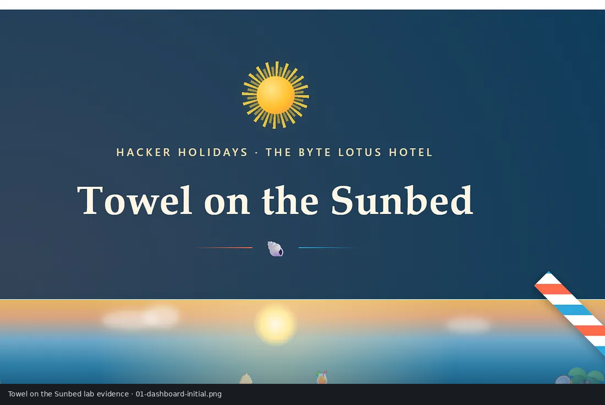
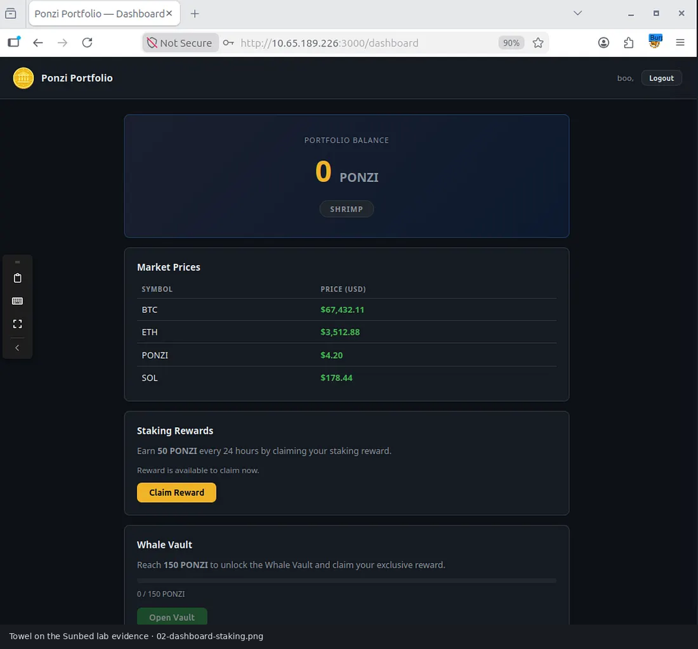
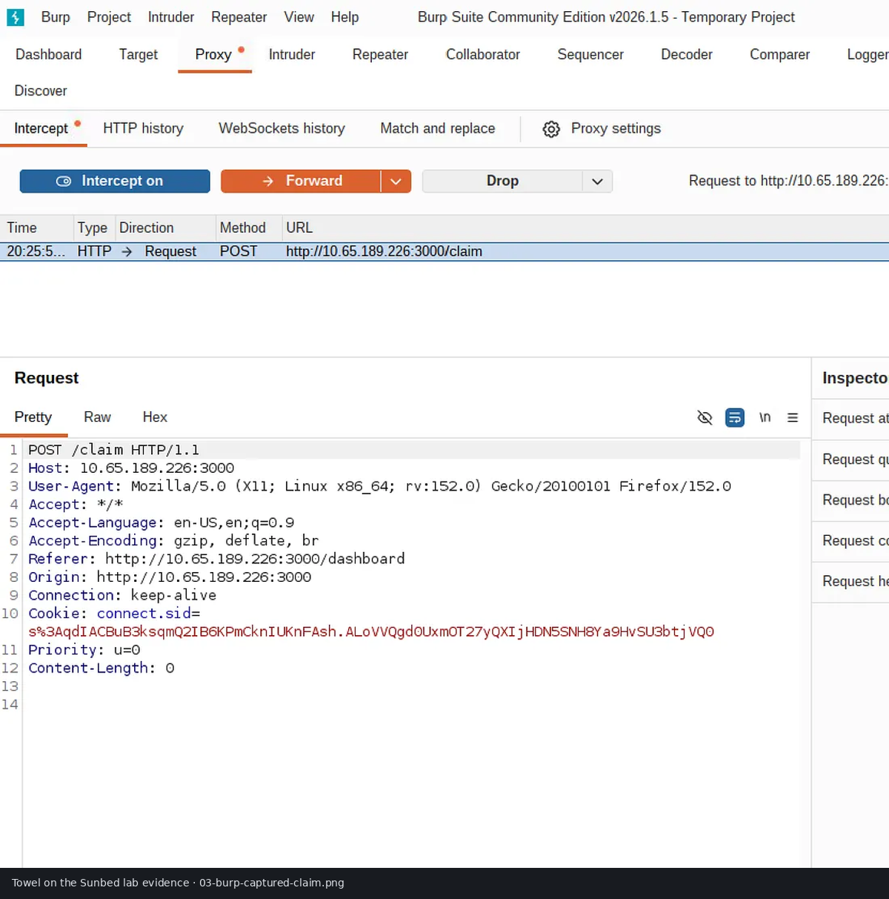
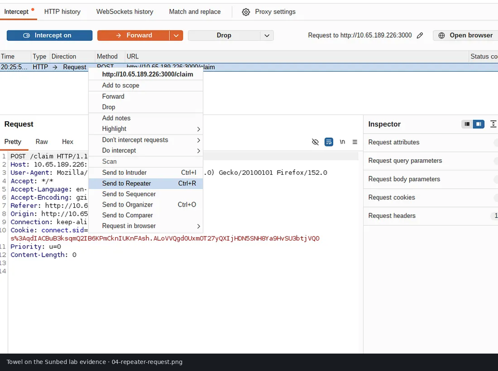
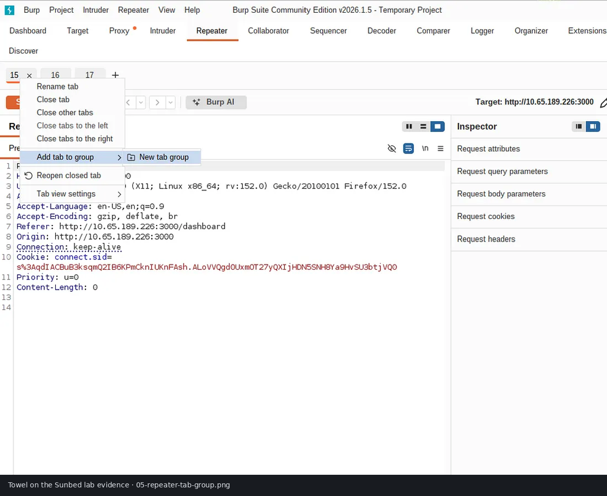
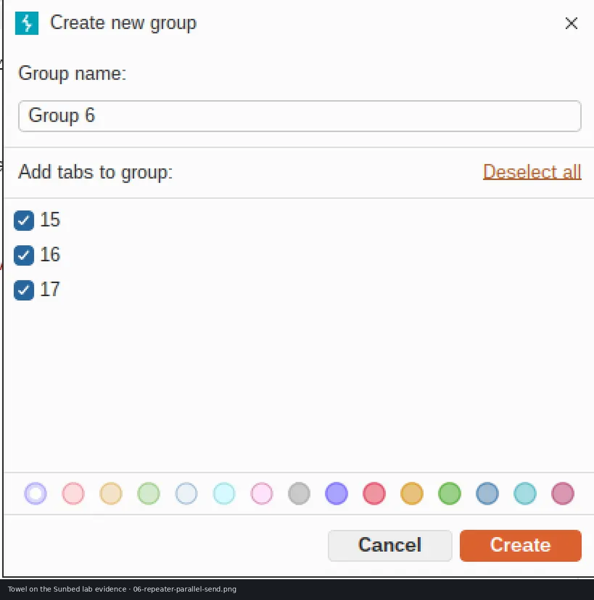
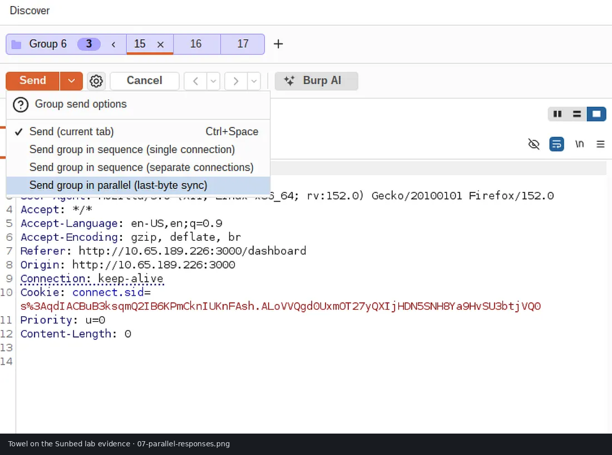
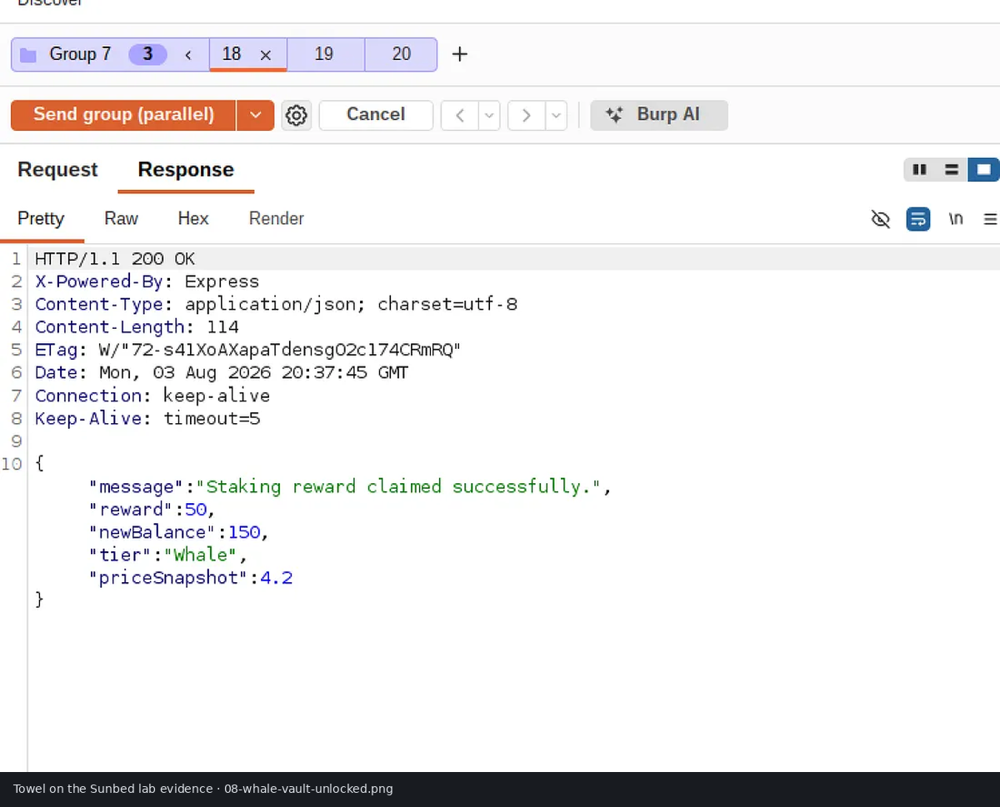
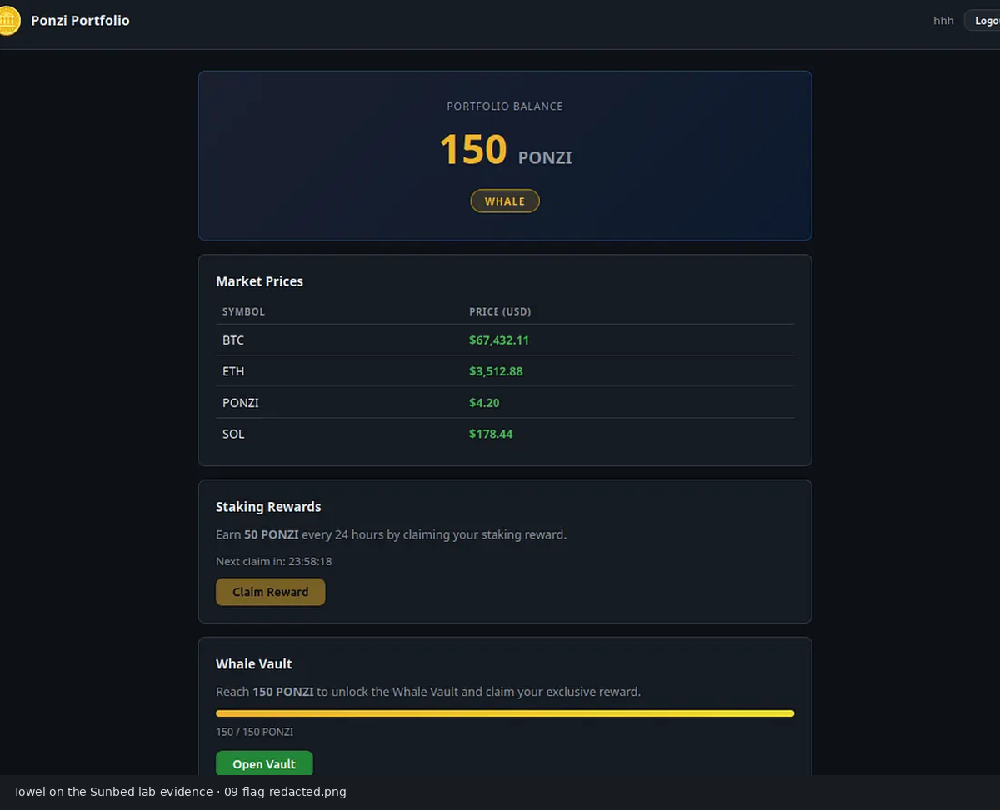
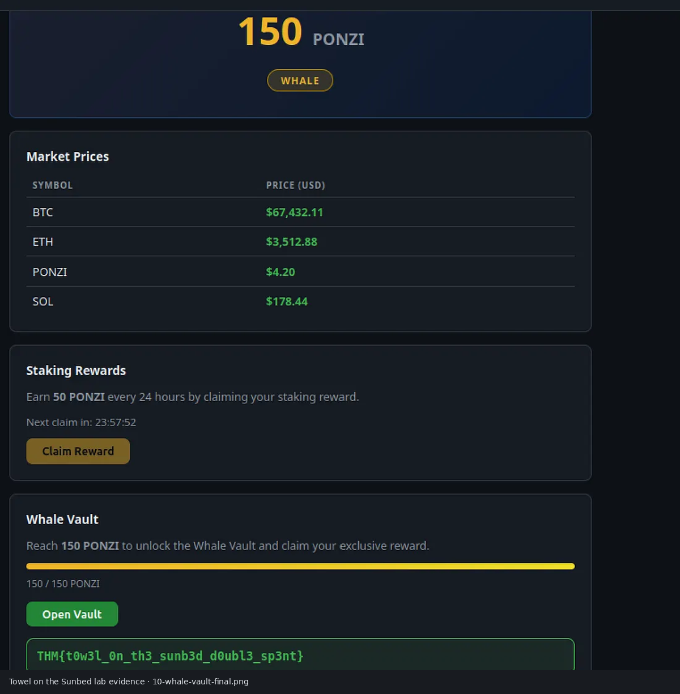

<div align="center">

# 🌞 Towel on the Sunbed

### Professional TryHackMe Walkthrough & Security Case Study

**Hacker Holidays — Day 8**

*Business Logic Race Condition • Burp Suite Repeater • Web Application Security*

<br>


---

### 👨‍💻 Cybersecurity Portfolio Documentation

*Documented and analyzed by **Anurag Revankar***

A complete penetration testing walkthrough demonstrating how concurrent HTTP requests can bypass server-side reward validation through a **business logic race condition**.

</div>

---

# 📑 Documentation Overview

> This page serves as the **official GitHub Pages documentation** for the **Towel on the Sunbed** TryHackMe room.

Instead of simply solving the challenge, this documentation explains:

- The application's business workflow.
- Enumeration methodology.
- HTTP interception process.
- Race condition exploitation.
- Root cause analysis.
- Defensive security recommendations.
- Blue Team detection opportunities.
- Security lessons learned.

It is designed as a **professional security case study** suitable for recruiters, hiring managers, and cybersecurity portfolio reviews.

---

# 🎯 Challenge Information

| Property | Details |
|-----------|---------|
| 🎮 Platform | **TryHackMe** |
| 🎄 Series | **Hacker Holidays** |
| ☀️ Room | **Towel on the Sunbed** |
| 🎯 Focus | Business Logic Vulnerability |
| 🧩 Vulnerability | Race Condition |
| 🛠️ Tools | Burp Suite Community Edition, Firefox |
| 💻 Environment | Linux Desktop |
| 📘 Documentation Type | Penetration Testing Report |

---

# 🧠 What You'll Learn

<div align="center">

| 🌐 Web Security | 🛡️ Burp Suite | 🔵 Blue Team |
|---|---|---|
| Business Logic Testing | HTTP Interception | Detection Opportunities |
| State Transition Analysis | Request Replay | Log Correlation |
| Race Conditions | Parallel Requests | Security Monitoring |
| Reward Workflow Abuse | Repeater Groups | Incident Investigation |

</div>

---

# 🗂️ Walkthrough Roadmap

```text
Authentication
      │
      ▼
Dashboard Enumeration
      │
      ▼
Reward Workflow Analysis
      │
      ▼
Capture HTTP Request
      │
      ▼
Burp Suite Repeater
      │
      ▼
Parallel Request Execution
      │
      ▼
Multiple Rewards Credited
      │
      ▼
Whale Vault Unlock
      │
      ▼
Root Cause Analysis & Mitigation
```

---

# ⚠️ Vulnerability Spotlight

<div align="center">

## Business Logic Race Condition

*"The application validates multiple reward requests before updating shared cooldown state."*

</div>

### Why this vulnerability matters

Unlike SQL Injection or XSS, race conditions exploit **application timing**.

The attacker never sends malformed input.

Instead, they abuse legitimate functionality by triggering multiple authenticated requests simultaneously.

### Security Principle Violated

```text
Expected
───────────────
Validate Reward
      │
Grant Reward
      │
Update Cooldown
      │
Reject Future Requests

Observed
───────────────
Validate Reward
Validate Reward
Validate Reward
      │
Grant Reward
Grant Reward
Grant Reward
      │
Update Cooldown
```

The cooldown mechanism is updated **too late**.

---

# 🌐 Stage 1 — Initial Application Enumeration

The assessment begins after authenticating into the cryptocurrency dashboard.



**Figure 1 — Initial dashboard presented after authentication**

### Key Observations

| Observation | Security Relevance |
|-------------|-------------------|
| Cryptocurrency dashboard | Primary attack surface. |
| Whale Vault locked | Privileged functionality gated by balance. |
| Reward button available | Candidate business logic endpoint. |
| Session-based login | Authenticated testing required. |

---

# 💰 Stage 2 — Understanding the Reward Mechanism

The dashboard explains how staking rewards work.



**Figure 2 — Daily staking reward mechanism**

### Expected Business Workflow

| Day | Reward | Balance |
|-----|--------|---------|
| Day 1 | +50 | 50 |
| Day 2 | +50 | 100 |
| Day 3 | +50 | 150 |

Only after Day 3 should the Whale Vault unlock.

This assumption becomes the primary target of testing.

---

# 🔍 Stage 3 — Capturing the Reward Request

Burp Suite Proxy intercepts the reward request before it reaches the server.



**Figure 3 — Captured authenticated reward request**

### Endpoint Characteristics

```http
POST /claim
```

**Authentication:** Session Cookie

**Purpose:** Claim staking reward.

### Why This Endpoint Is Interesting

- Authenticated.
- State-changing.
- Updates user balance.
- Enforces cooldown.
- Ideal candidate for concurrency testing.

---

# 🔁 Stage 4 — Burp Suite Repeater

The intercepted request is transferred into **Burp Repeater**.



**Figure 4 — Reward request inside Burp Repeater**

### Why Repeater?

- Preserve session.
- Duplicate requests.
- Replay safely.
- Execute grouped requests simultaneously.

---

# ⚡ Stage 5 — Parallel Request Groups

Multiple identical requests are grouped.



**Figure 5 — Request grouping inside Repeater**

### Testing Goal

> Determine whether multiple requests pass reward validation before cooldown is committed.

---

# 🚀 Stage 6 — Triggering the Race Condition

Burp Suite sends every grouped request simultaneously.



**Figure 6 — Parallel execution**

### Concurrency Visualization

```text
Request A
Request B
Request C

      │
      ▼

Server receives requests together.

      │
      ▼

Cooldown still valid for every request.
```

No payload modification was required.

---

# 📊 Stage 7 — Response Analysis

The responses reveal inconsistent business logic behavior.



**Figure 7 — Multiple successful reward responses**

### Observed Behavior

| Request | Result |
|---------|--------|
| Request A | ✅ Success |
| Request B | ✅ Success |
| Request C | ✅ Success |

Multiple authenticated requests receive valid rewards.

---

# 🏆 Stage 8 — Whale Vault Unlock

Refreshing the dashboard confirms persistent application state changes.



**Figure 8 — Whale Vault unlocked**

### Validation Result

- Balance permanently increased.
- Whale status activated.
- Vault accessible.

This confirms the race condition affected **server-side state**, not client-side UI.

---

# 🔒 Stage 9 — Completion Evidence



**Figure 9 — Challenge completion evidence**

> The final flag has been intentionally **redacted** for responsible public documentation.

---

# ✅ Stage 10 — Final Application State



**Figure 10 — Final completed application state**

---

# 🔬 Root Cause Analysis

## Why the Vulnerability Exists

The reward endpoint appears to perform validation separately from state updates.

### Secure Design

```text
BEGIN TRANSACTION

Check cooldown
Lock reward record
Update balance
Update cooldown

COMMIT
```

### Vulnerable Design

```python
if reward_available(user):
    add_reward(user)
    update_cooldown(user)
```

Every concurrent request evaluates `reward_available()` before cooldown changes.

---

# 🛡️ Security Impact

## Potential Real-World Risk

| Industry | Possible Abuse |
|----------|----------------|
| Crypto Wallets | Duplicate token rewards. |
| Cashback Apps | Cashback farming. |
| Loyalty Programs | Unlimited points. |
| Banking Apps | Double credit transactions. |
| E-commerce | Coupon reuse. |

### CIA Impact

| Principle | Severity |
|-----------|----------|
| Confidentiality | 🟢 Low |
| Integrity | 🔴 High |
| Availability | 🟢 Low |

---

# 🔵 Blue Team Detection Opportunities

SOC analysts can detect race-condition abuse through unusual reward activity.

### Indicators

| Signal | Detection Strategy |
|--------|--------------------|
| Multiple POST `/claim` | Same session within milliseconds. |
| Duplicate reward events | Balance anomaly detection. |
| Rapid privilege progression | Reward threshold monitoring. |
| High-frequency authenticated requests | Behavioral analytics. |

### Example Detection Rule

```text
IF

Same Session
POST /claim
≥2 Successful Requests
Within One Second

THEN

Raise Business Logic Abuse Alert.
```

---

# 🧬 MITRE ATT&CK Mapping

| Technique | Why It Applies |
|-----------|----------------|
| **Valid Accounts (T1078)** | Exploit uses authenticated account. |
| **Application Layer Protocol (T1071)** | HTTP communication used. |
| **Exploitation of Public-Facing Application** | Vulnerable web endpoint targeted. |

---

# 📚 OWASP Mapping

| OWASP Category | Relevance |
|----------------|----------|
| **A01 — Broken Access Control** | Business functionality unlocked improperly. |
| **A04 — Insecure Design** | Missing concurrency controls. |
| **A05 — Security Misconfiguration** | Improper reward workflow implementation. |

---

# 🛠️ Defensive Recommendations

### Immediate Fixes

- Atomic reward transactions.
- Row-level locking.
- Idempotency keys.
- Server-side cooldown enforcement.
- Concurrency regression testing.
- Audit logging.

### Secure Reward Workflow

```text
User
 │
 ▼
Reward Service
 │
 ▼
Transaction Lock
 │
 ▼
Eligibility Validation
 │
 ▼
Balance Update
 │
 ▼
Cooldown Commit
 │
 ▼
Audit Log
 │
 ▼
Response
```

---

# 📖 Key Learning Outcomes

After completing this room, I practiced:

- Business Logic Vulnerability Analysis.
- HTTP Request Interception.
- Burp Suite Repeater.
- Concurrent Request Testing.
- State Transition Validation.
- Security Documentation.
- Defensive Mitigation Planning.

---

# 📂 Repository Structure

```text
Towel-on-the-Sunbed-TryHackMe-Walkthrough/
├── Documentation/
│   ├── Documentation.md
│   └── Documentation.docx
├── Resources/
│   └── notes.md
├── Screenshots/
├── docs/
│   ├── index.md
│   └── assets/
└── README.md
```

---

# 📸 Screenshot Gallery

| Stage | Screenshot |
|-------|------------|
| Dashboard | `01-dashboard-initial.png` |
| Reward Workflow | `02-dashboard-staking.png` |
| HTTP Capture | `03-burp-captured-claim.png` |
| Burp Repeater | `04-repeater-request.png` |
| Request Group | `05-repeater-tab-group.png` |
| Parallel Execution | `06-repeater-parallel-send.png` |
| Responses | `07-parallel-responses.png` |
| Vault Unlock | `08-whale-vault-unlocked.png` |
| Redacted Flag | `09-flag-redacted.png` |
| Final State | `10-whale-vault-final.png` |

---

# ⚖️ Responsible Disclosure

This documentation was created **exclusively for an authorized TryHackMe training environment**.

The repository exists for:

- Cybersecurity education.
- Portfolio documentation.
- Responsible security research.
- Secure software development awareness.

No techniques demonstrated here should be used against systems without explicit authorization.

---

<div align="center">

## 👨‍💻 Cybersecurity Portfolio

# Anurag Revankar

**Web Application Security • Penetration Testing • SOC & Blue Team • TryHackMe Documentation**

⭐ *Thank you for visiting this security case study.*

</div>
