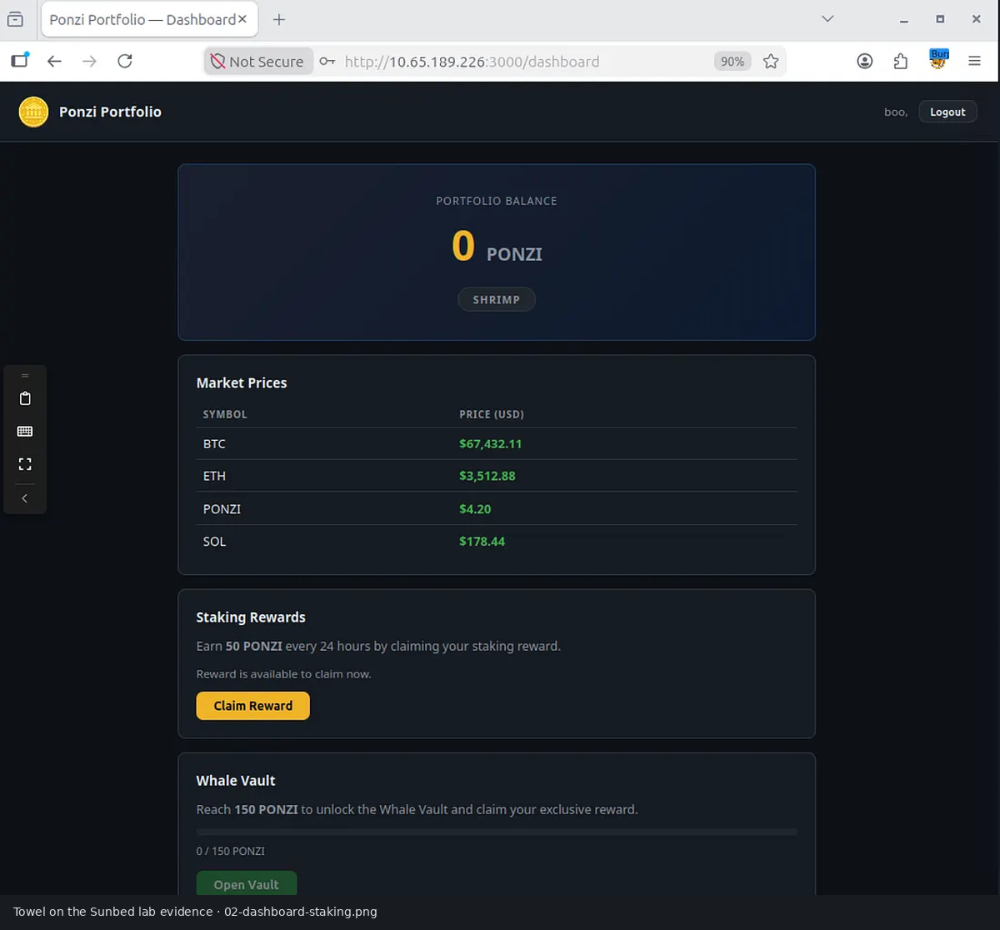
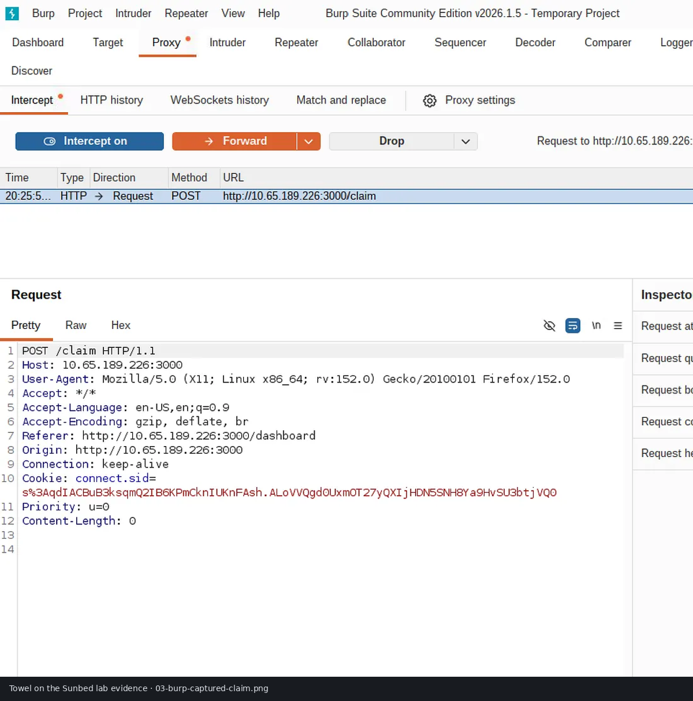
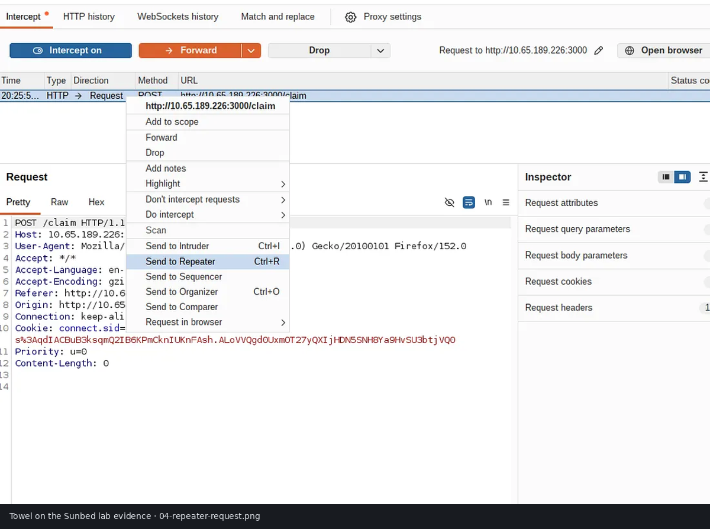
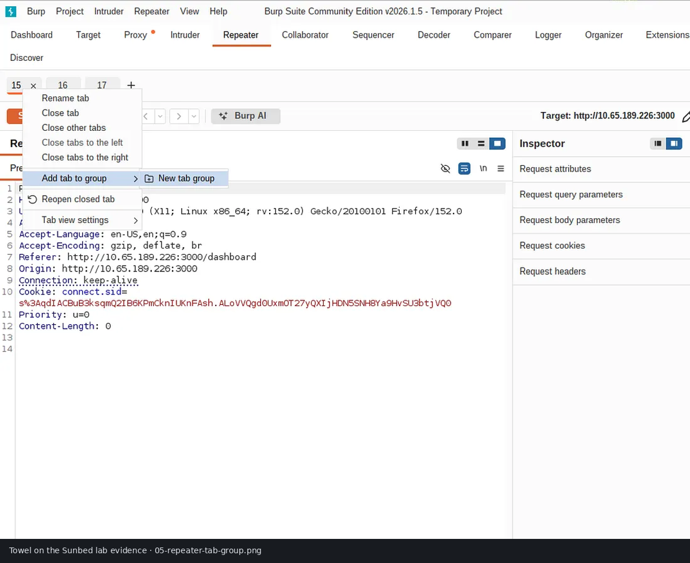
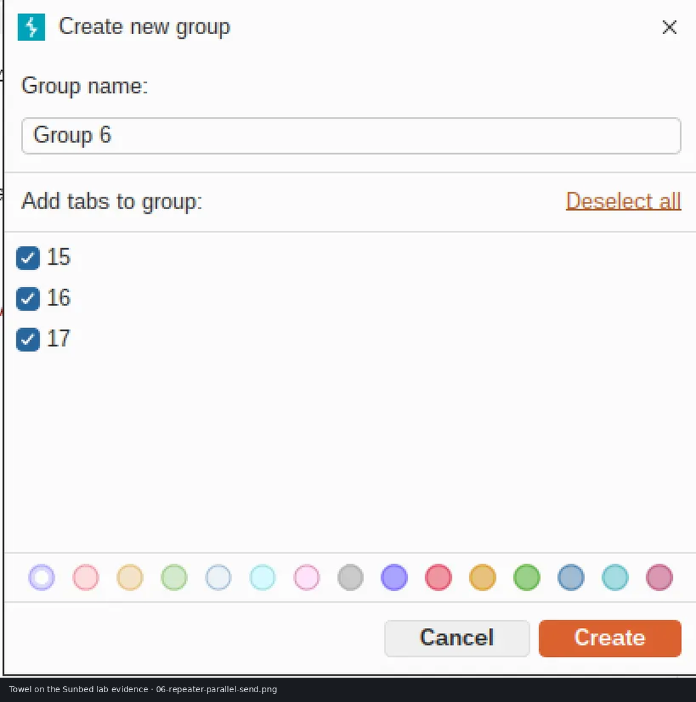
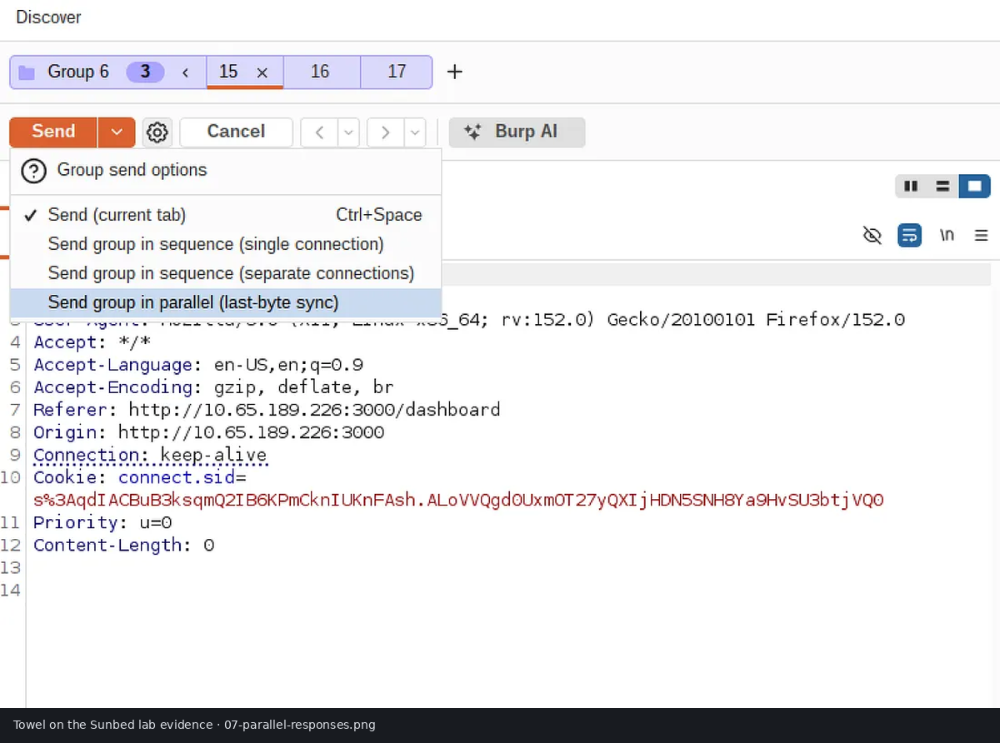
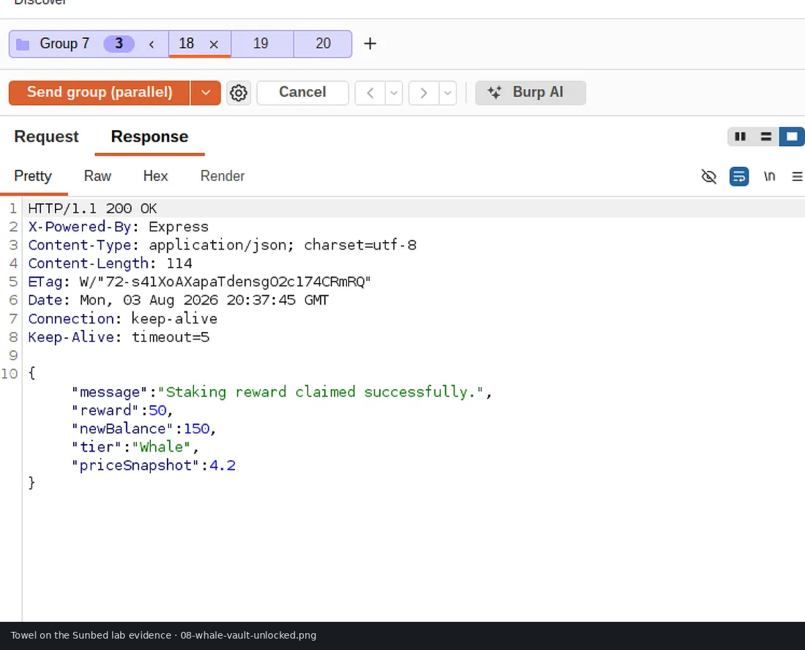
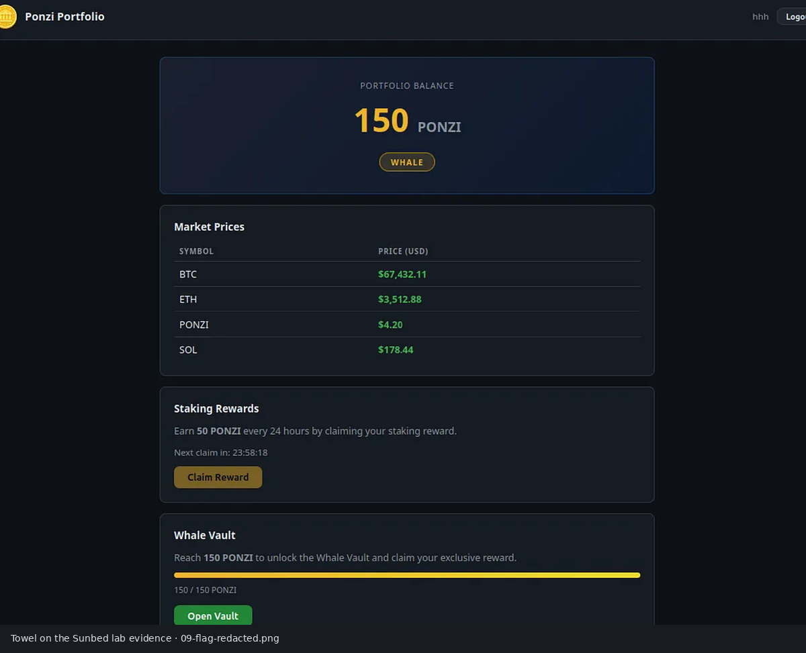
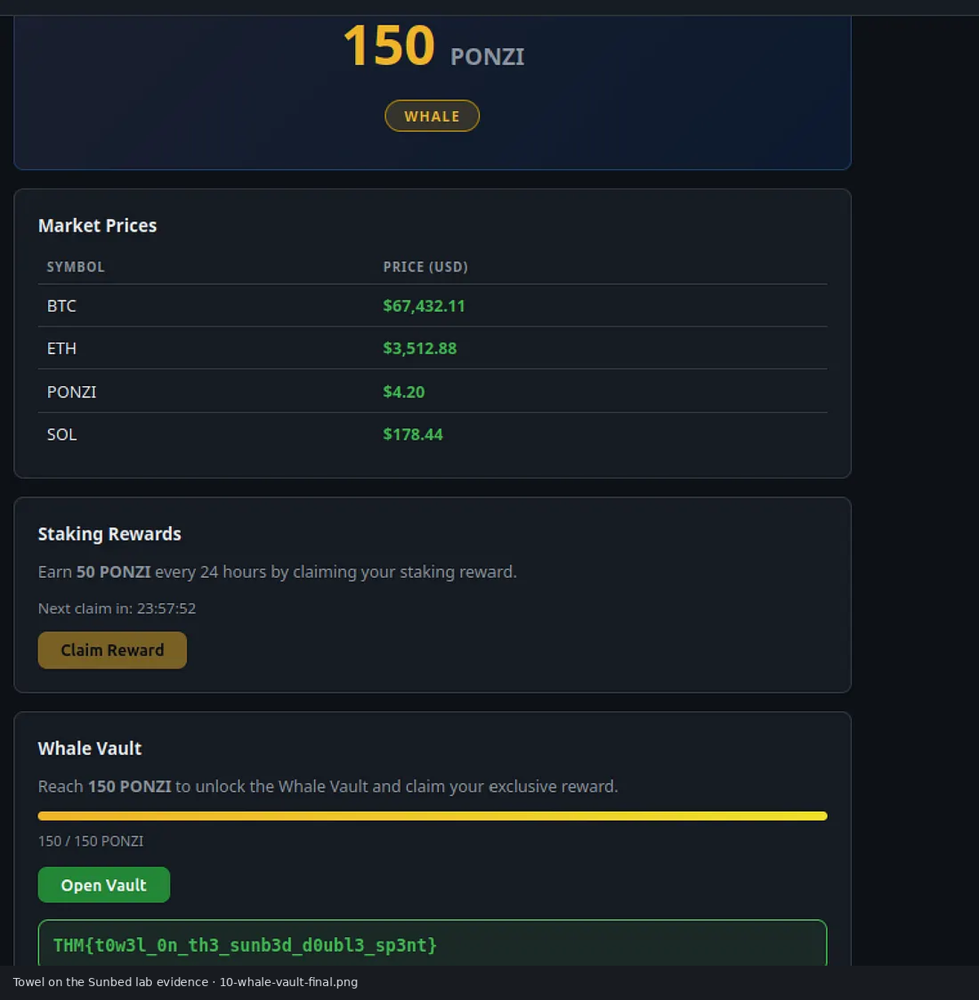

<div class="ctf-hero">

  <h1>🌞 Towel on the Sunbed</h1>

  <p>
    A professional TryHackMe security case study demonstrating how a
    <strong>business logic race condition</strong> can be exploited through
    concurrent authenticated HTTP requests to bypass a reward cooldown
    mechanism.
  </p>

  <div class="ctf-badges">
    <span class="ctf-badge">TryHackMe</span>
    <span class="ctf-badge">Hacker Holidays</span>
    <span class="ctf-badge">Easy</span>
    <span class="ctf-badge">Business Logic</span>
    <span class="ctf-badge">Race Condition</span>
    <span class="ctf-badge">Burp Suite</span>
  </div>

</div>

<div class="ctf-card-grid">

  <div class="ctf-card">
    <div class="ctf-card-title">Platform</div>
    <div class="ctf-card-value">TryHackMe</div>
  </div>

  <div class="ctf-card">
    <div class="ctf-card-title">Series</div>
    <div class="ctf-card-value">Hacker Holidays</div>
  </div>

  <div class="ctf-card">
    <div class="ctf-card-title">Challenge</div>
    <div class="ctf-card-value">Towel on the Sunbed</div>
  </div>

  <div class="ctf-card">
    <div class="ctf-card-title">Difficulty</div>
    <div class="ctf-card-value">Easy</div>
  </div>

  <div class="ctf-card">
    <div class="ctf-card-title">Primary Focus</div>
    <div class="ctf-card-value">Business Logic Race Condition</div>
  </div>

  <div class="ctf-card">
    <div class="ctf-card-title">Tools</div>
    <div class="ctf-card-value">Burp Suite Community Edition, Firefox</div>
  </div>

</div>

<div class="ctf-toc">

  <div class="ctf-toc-title">Navigation</div>

  <ul>
    <li><a href="#mission">Mission</a></li>
    <li><a href="#quick-overview">Quick Overview</a></li>
    <li><a href="#attack-chain">Attack Chain</a></li>
    <li><a href="#learning-objectives">Learning Objectives</a></li>
    <li><a href="#lab-environment">Lab Environment</a></li>
    <li><a href="#vulnerability-spotlight">Vulnerability Spotlight</a></li>
    <li><a href="#initial-application-enumeration">Initial Application Enumeration</a></li>
    <li><a href="#reward-mechanism-analysis">Reward Mechanism Analysis</a></li>
    <li><a href="#capturing-the-reward-request">Capturing the Reward Request</a></li>
    <li><a href="#burp-suite-repeater">Burp Suite Repeater</a></li>
    <li><a href="#parallel-request-testing">Parallel Request Testing</a></li>
    <li><a href="#race-condition-exploitation">Race Condition Exploitation</a></li>
    <li><a href="#response-analysis">Response Analysis</a></li>
    <li><a href="#whale-vault-unlock">Whale Vault Unlock</a></li>
    <li><a href="#completion-evidence">Completion Evidence</a></li>
    <li><a href="#final-application-state">Final Application State</a></li>
    <li><a href="#root-cause-analysis">Root Cause Analysis</a></li>
    <li><a href="#security-impact">Security Impact</a></li>
    <li><a href="#blue-team-detection-opportunities">Blue Team Detection Opportunities</a></li>
    <li><a href="#mitre-attck-mapping">MITRE ATT&amp;CK Mapping</a></li>
    <li><a href="#owasp-mapping">OWASP Mapping</a></li>
    <li><a href="#defensive-recommendations">Defensive Recommendations</a></li>
    <li><a href="#key-findings">Key Findings</a></li>
    <li><a href="#tools-used">Tools Used</a></li>
    <li><a href="#learning-outcomes">Learning Outcomes</a></li>
    <li><a href="#repository-structure">Repository Structure</a></li>
    <li><a href="#screenshot-gallery">Screenshot Gallery</a></li>
    <li><a href="#responsible-use">Responsible Use</a></li>
  </ul>

</div>

---

## Mission

The objective of **Towel on the Sunbed** is to analyze an authenticated cryptocurrency dashboard and identify whether its reward workflow can be abused through a business logic flaw.

The documented attack focuses on the application's staking reward mechanism.

The intended workflow allows a user to receive a reward once per day. By analyzing the underlying HTTP request and sending multiple copies concurrently, the challenge demonstrates how a race condition can cause several requests to pass validation before the shared cooldown state is updated.

The resulting state change unlocks the application's **Whale Vault**.

---

## Quick Overview

| Property | Details |
|---|---|
| Platform | **TryHackMe** |
| Series | **Hacker Holidays** |
| Room | **Towel on the Sunbed** |
| Difficulty | **Easy** |
| Focus | **Business Logic Vulnerability** |
| Vulnerability | **Race Condition** |
| Tools | **Burp Suite Community Edition, Firefox** |
| Environment | **Linux Desktop** |
| Documentation Type | **Penetration Testing Report / Security Case Study** |

### Core Security Concept

The vulnerability does not depend on malformed input.

Instead, the attack abuses the timing of legitimate authenticated requests:

```text
Legitimate Reward Request
          │
          ▼
Eligibility Validation
          │
          ▼
Reward Granted
          │
          ▼
Cooldown Updated
```

Under concurrent execution, several requests can reach the validation stage before the cooldown state is committed:

```text
Request A ───────┐
Request B ───────┼──► Eligibility Check
Request C ───────┘          │
                            ▼
                    Multiple Requests
                    Pass Validation
                            │
                            ▼
                    Multiple Rewards
                            │
                            ▼
                    Cooldown Updated
```

This creates an integrity-impacting business logic flaw.

---

## Attack Chain

<div class="attack-chain">

  <div class="attack-step">Authenticated Dashboard</div>

  <div class="attack-arrow">→</div>

  <div class="attack-step">Reward Workflow Analysis</div>

  <div class="attack-arrow">→</div>

  <div class="attack-step">Capture POST /claim</div>

  <div class="attack-arrow">→</div>

  <div class="attack-step">Burp Repeater</div>

  <div class="attack-arrow">→</div>

  <div class="attack-step">Parallel Requests</div>

  <div class="attack-arrow">→</div>

  <div class="attack-step">Race Condition</div>

  <div class="attack-arrow">→</div>

  <div class="attack-step">Multiple Rewards</div>

  <div class="attack-arrow">→</div>

  <div class="attack-step">Whale Vault Unlocked</div>

</div>

The documented attack path is therefore:

```text
Authentication
      │
      ▼
Dashboard Enumeration
      │
      ▼
Reward Workflow Analysis
      │
      ▼
Capture HTTP Request
      │
      ▼
Burp Suite Repeater
      │
      ▼
Parallel Request Execution
      │
      ▼
Multiple Rewards Credited
      │
      ▼
Whale Vault Unlock
      │
      ▼
Root Cause Analysis & Mitigation
```

---

## Learning Objectives

The challenge provides practical experience with:

- Business logic vulnerability analysis.
- HTTP request interception.
- Burp Suite Repeater.
- Concurrent request testing.
- State transition analysis.
- Reward workflow abuse.
- Server-side state validation.
- Security impact analysis.
- Blue Team detection opportunities.
- Defensive mitigation planning.

---

## Lab Environment

The documented assessment was performed against an authorized **TryHackMe Hacker Holidays** training environment.

| Component | Documented Value |
|---|---|
| Platform | TryHackMe |
| Environment | Linux Desktop |
| Application | Cryptocurrency dashboard |
| Browser | Firefox |
| Proxy / Testing Tool | Burp Suite Community Edition |
| Authentication | Session-based login |

No external production system is involved in the documented activity.

---

## Vulnerability Spotlight

### Business Logic Race Condition

> The application validates multiple reward requests before updating shared cooldown state.

A race condition occurs when the security or business outcome of an operation depends on the timing or ordering of concurrent requests.

In this challenge, the intended control is a reward cooldown.

The expected workflow is:

```text
Validate Reward
      │
      ▼
Grant Reward
      │
      ▼
Update Cooldown
      │
      ▼
Reject Future Requests
```

The observed vulnerable behavior is:

```text
Validate Reward
Validate Reward
Validate Reward
      │
      ▼
Grant Reward
Grant Reward
Grant Reward
      │
      ▼
Update Cooldown
```

The critical issue is that the shared cooldown state is updated **after multiple requests have already passed the eligibility check**.

### Why the Vulnerability Matters

Unlike common injection vulnerabilities such as SQL injection or XSS, the documented attack does not require malicious input.

The attacker uses:

- a valid authenticated session,
- a legitimate reward endpoint,
- legitimate request parameters,
- and concurrent request execution.

The security boundary is therefore the application's **business workflow and state management**, rather than its input parser.

---

## Initial Application Enumeration

The assessment begins after authenticating into the cryptocurrency dashboard.

<figure>

  

  <figcaption>
    Figure 1 — Initial dashboard presented after authentication.
  </figcaption>

</figure>

### Key Observations

| Observation | Security Relevance |
|---|---|
| Cryptocurrency dashboard | Primary application attack surface. |
| Whale Vault locked | Privileged functionality gated by balance. |
| Reward button available | Candidate business logic functionality. |
| Session-based login | Authenticated testing is required. |

The presence of a reward mechanism and a locked Whale Vault establishes a clear relationship between application state and user balance.

That makes the reward workflow a logical area for further security testing.

---

## Reward Mechanism Analysis

The dashboard explains how staking rewards work.

<figure>

  

  <figcaption>
    Figure 2 — Daily staking reward mechanism.
  </figcaption>

</figure>

### Expected Business Workflow

| Day | Reward | Balance |
|---|---:|---:|
| Day 1 | +50 | 50 |
| Day 2 | +50 | 100 |
| Day 3 | +50 | 150 |

Only after Day 3 should the Whale Vault unlock.

This expected progression makes the reward claim operation a high-value target for business logic testing.

### Testing Question

The key question becomes:

> Does the server enforce the reward cooldown atomically when multiple authenticated requests arrive at approximately the same time?

---

## Capturing the Reward Request

Burp Suite Proxy is used to intercept the reward request before it reaches the server.

<figure>

  

  <figcaption>
    Figure 3 — Captured authenticated reward request.
  </figcaption>

</figure>

### Documented Endpoint

```http
POST /claim
```

**Authentication:** Session Cookie

**Purpose:** Claim staking reward.

### Why `/claim` Is a Relevant Test Target

The endpoint has several properties that make it important from a business logic perspective:

- It is authenticated.
- It changes server-side state.
- It affects the user's balance.
- It enforces a reward cooldown.
- It represents a state-changing business operation.
- It can therefore be evaluated for concurrency weaknesses.

---

## Burp Suite Repeater

The intercepted request is transferred into **Burp Suite Repeater**.

<figure>

  

  <figcaption>
    Figure 4 — Reward request inside Burp Suite Repeater.
  </figcaption>

</figure>

### Why Repeater?

Repeater provides the ability to:

- Preserve the authenticated session.
- Duplicate the captured request.
- Replay requests.
- Organize multiple requests.
- Test request behavior under controlled conditions.

The objective at this stage is not to modify the request payload.

Instead, the objective is to determine whether **request timing and concurrency** affect server-side validation.

---

## Parallel Request Testing

Multiple identical requests are grouped in Burp Suite Repeater.

<figure>

  

  <figcaption>
    Figure 5 — Request grouping inside Repeater.
  </figcaption>

</figure>

### Testing Goal

> Determine whether multiple requests pass reward validation before cooldown state is committed.

The requests represent the same legitimate authenticated reward operation.

The security test therefore focuses on **concurrent execution rather than payload manipulation**.

---

## Race Condition Exploitation

Burp Suite sends the grouped requests simultaneously.

<figure>

  

  <figcaption>
    Figure 6 — Parallel execution of the grouped reward requests.
  </figcaption>

</figure>

### Concurrency Model

```text
Request A
Request B
Request C

      │
      ▼

Server receives requests together.

      │
      ▼

Cooldown remains valid
during the concurrent validation window.
```

No payload modification is required.

The exploitation condition is created by the timing of otherwise valid requests.

---

## Response Analysis

The responses reveal inconsistent business logic behavior.

<figure>

  

  <figcaption>
    Figure 7 — Multiple successful reward responses.
  </figcaption>

</figure>

### Observed Behavior

| Request | Result |
|---|---|
| Request A | ✅ Success |
| Request B | ✅ Success |
| Request C | ✅ Success |

Multiple authenticated requests receive valid rewards.

This confirms that the application's reward validation does not adequately prevent concurrent claims from being processed during the same state window.

---

## Whale Vault Unlock

Refreshing the dashboard confirms persistent application state changes.

<figure>

  

  <figcaption>
    Figure 8 — Whale Vault unlocked.
  </figcaption>

</figure>

### Validation Result

The documented result includes:

- Balance permanently increased.
- Whale status activated.
- Vault accessible.

This is important because the result confirms that the race condition affected **server-side application state**, rather than only changing the client-side interface.

---

## Completion Evidence

<figure>

  

  <figcaption>
    Figure 9 — Challenge completion evidence. The flag remains intentionally redacted.
  </figcaption>

</figure>

> The final flag has been intentionally **redacted** for responsible public documentation.

The original documentation intentionally does not expose the flag value, and that redaction is preserved here.

---

## Final Application State

<figure>

  

  <figcaption>
    Figure 10 — Final completed application state.
  </figcaption>

</figure>

The final state provides visual confirmation of the completed application workflow following exploitation of the race condition.

---

## Root Cause Analysis

### Why the Vulnerability Exists

The documented behavior indicates that the reward endpoint performs eligibility validation separately from the state update that establishes the cooldown.

The vulnerable logic can be represented as:

```python
if reward_available(user):
    add_reward(user)
    update_cooldown(user)
```

When concurrent requests arrive, each request can evaluate:

```text
reward_available(user)
```

before the cooldown update becomes effective.

This creates a timing window in which several requests can independently satisfy the same eligibility condition.

### Vulnerable Sequence

```text
Request A ──► Check reward availability ──► PASS
Request B ──► Check reward availability ──► PASS
Request C ──► Check reward availability ──► PASS
                    │
                    ▼
              Rewards granted
                    │
                    ▼
             Cooldown updated
```

### Secure Design

A safer workflow should make validation and state modification part of an atomic operation:

```text
BEGIN TRANSACTION
      │
      ▼
Check cooldown
      │
      ▼
Lock reward record
      │
      ▼
Update balance
      │
      ▼
Update cooldown
      │
      ▼
COMMIT
```

The essential requirement is that concurrent requests cannot independently pass the same eligibility check before the state transition is committed.

---

## Security Impact

### Potential Real-World Risk

The documented business logic flaw could represent reward or transaction abuse in systems where a state-changing operation is expected to occur only once within a defined period.

| Industry | Possible Abuse |
|---|---|
| Crypto Wallets | Duplicate token rewards |
| Cashback Apps | Cashback farming |
| Loyalty Programs | Unlimited points |
| Banking Apps | Double credit transactions |
| E-commerce | Coupon reuse |

These examples illustrate the class of business logic risk demonstrated by the CTF.

### CIA Impact

| Principle | Severity |
|---|---|
| Confidentiality | 🟢 Low |
| Integrity | 🔴 High |
| Availability | 🟢 Low |

The primary documented impact is **integrity**, because the vulnerability allows application state and reward balances to be modified beyond the intended business rules.

---

## Blue Team Detection Opportunities

A race-condition abuse pattern can produce behavioral indicators that are useful for SOC monitoring and application security telemetry.

### Detection Indicators

| Signal | Detection Strategy |
|---|---|
| Multiple `POST /claim` requests | Identify the same session making repeated claims within milliseconds. |
| Duplicate reward events | Correlate reward transactions with application balance changes. |
| Rapid privilege progression | Monitor users reaching reward thresholds significantly faster than expected. |
| High-frequency authenticated requests | Apply behavioral analytics to unusual request bursts. |

### Example Detection Rule

```text
IF

Same Session
POST /claim
≥2 Successful Requests
Within One Second

THEN

Raise Business Logic Abuse Alert.
```

The detection approach should correlate HTTP activity with the resulting business event rather than relying solely on request volume.

---

## MITRE ATT&CK Mapping

The original documentation identifies the following ATT&CK mappings.

| Technique | ID | Evidence |
|---|---|---|
| Valid Accounts | **T1078** | The documented exploitation uses an authenticated account and session. |
| Application Layer Protocol | **T1071** | The attack operates through HTTP communication with the web application. |
| Exploitation of Public-Facing Application | — | The vulnerable web endpoint is targeted through the application interface. |

These mappings are retained from the original documentation and are presented as contextual mappings for the documented activity.

---

## OWASP Mapping

The original documentation associates the vulnerability with the following OWASP categories:

| OWASP Category | Relevance |
|---|---|
| **A01 — Broken Access Control** | Business functionality becomes improperly accessible through abuse of the intended workflow. |
| **A04 — Insecure Design** | The reward workflow lacks appropriate concurrency controls. |
| **A05 — Security Misconfiguration** | The original documentation identifies improper reward workflow implementation as relevant to the issue. |

The core technical issue demonstrated by the challenge is the application's **business logic and concurrency handling**.

---

## Defensive Recommendations

### Atomic Reward Transactions

Reward eligibility checks and balance updates should occur within an atomic transaction.

```text
Reward Request
      │
      ▼
Transaction Lock
      │
      ▼
Eligibility Validation
      │
      ▼
Balance Update
      │
      ▼
Cooldown Commit
      │
      ▼
Audit Log
      │
      ▼
Response
```

### Row-Level Locking

Where applicable, locking the relevant reward or account record can prevent concurrent requests from independently passing the same eligibility check.

### Idempotency Keys

State-changing reward operations can use idempotency controls so repeated requests cannot create duplicate business events.

### Server-Side Cooldown Enforcement

Cooldown validation must be enforced by the server and must remain effective throughout the complete state transition.

### Concurrency Regression Testing

Security and application tests should intentionally send concurrent requests against state-changing endpoints to verify that business rules remain atomic.

### Audit Logging

Reward claims should generate auditable events containing sufficient context to identify:

- authenticated session,
- reward operation,
- timestamp,
- resulting state change,
- repeated or anomalous requests.

---

## Key Findings

<div class="key-finding">

  <div class="key-finding-title">
    Business Logic Race Condition
  </div>

  The reward workflow allows multiple concurrent authenticated requests to pass eligibility validation before the shared cooldown state is updated.
  
</div>

<div class="key-finding">

  <div class="key-finding-title">
    Server-Side State Impact
  </div>

  The exploitation resulted in a persistent balance increase, activated Whale status, and unlocked the Whale Vault, demonstrating that the issue affects server-side application state rather than only client-side presentation.
  
</div>

<div class="key-finding">

  <div class="key-finding-title">
    Concurrency Is the Attack Primitive
  </div>

  The documented exploitation does not require malformed input. The security weakness is triggered by executing legitimate authenticated reward requests concurrently.
  
</div>

---

## Tools Used

<div class="tool-list">

  <span class="tool-tag">Burp Suite Community Edition</span>
  <span class="tool-tag">Firefox</span>

</div>

| Tool | Documented Purpose |
|---|---|
| **Burp Suite Community Edition** | Intercept, duplicate, group, replay, and execute the authenticated reward request concurrently. |
| **Firefox** | Access and interact with the TryHackMe cryptocurrency dashboard. |

No additional tools are introduced beyond those documented in the original walkthrough.

---

## Learning Outcomes

This challenge provided practical experience with:

- **Business Logic Testing** — analyzing whether application workflows enforce their intended rules.
- **HTTP Interception** — identifying and examining state-changing requests.
- **Burp Suite Repeater** — replaying and grouping authenticated requests.
- **Race Condition Testing** — evaluating application behavior under concurrent requests.
- **State Transition Analysis** — comparing expected and observed application state.
- **Server-Side Validation** — verifying that exploitation affects persistent application state.
- **Security Impact Analysis** — translating a CTF vulnerability into realistic business risks.
- **Blue Team Detection** — identifying request and transaction patterns that can indicate abuse.
- **Defensive Engineering** — applying atomic transactions, locking, idempotency, and audit logging.

---

## Repository Structure

The documented repository structure is:

```text
Towel-on-the-Sunbed-TryHackMe-Walkthrough/
├── Documentation/
│   ├── Documentation.md
│   └── Documentation.docx
├── Resources/
│   └── notes.md
├── Screenshots/
├── docs/
│   ├── index.md
│   └── assets/
└── README.md
```

The GitHub Pages documentation is represented by:

```text
docs/index.md
```

with the screenshot assets referenced from the `docs/` document.

---

## Screenshot Gallery

| Stage | Screenshot |
|---|---|
| Dashboard | `01-dashboard-initial.png` |
| Reward Workflow | `02-dashboard-staking.png` |
| HTTP Capture | `03-burp-captured-claim.png` |
| Burp Repeater | `04-repeater-request.png` |
| Request Group | `05-repeater-tab-group.png` |
| Parallel Execution | `06-repeater-parallel-send.png` |
| Responses | `07-parallel-responses.png` |
| Vault Unlock | `08-whale-vault-unlocked.png` |
| Redacted Flag | `09-flag-redacted.png` |
| Final State | `10-whale-vault-final.png` |

All screenshot paths used by the walkthrough remain relative to:

```text
docs/index.md
```

The original filenames have not been renamed or replaced.

---

## Responsible Use

This documentation was created **exclusively for an authorized TryHackMe training environment**.

The techniques described here should only be used against systems for which explicit authorization to test has been granted.

This repository exists for:

- Cybersecurity education.
- CTF and penetration-testing practice.
- Portfolio documentation.
- Responsible security research.
- Secure software development awareness.
- Defensive security understanding.

---

